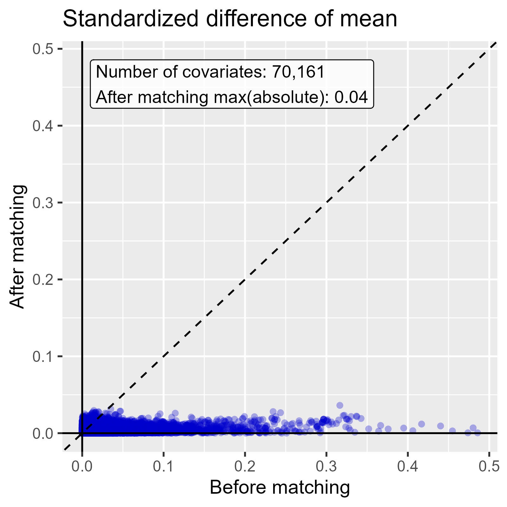
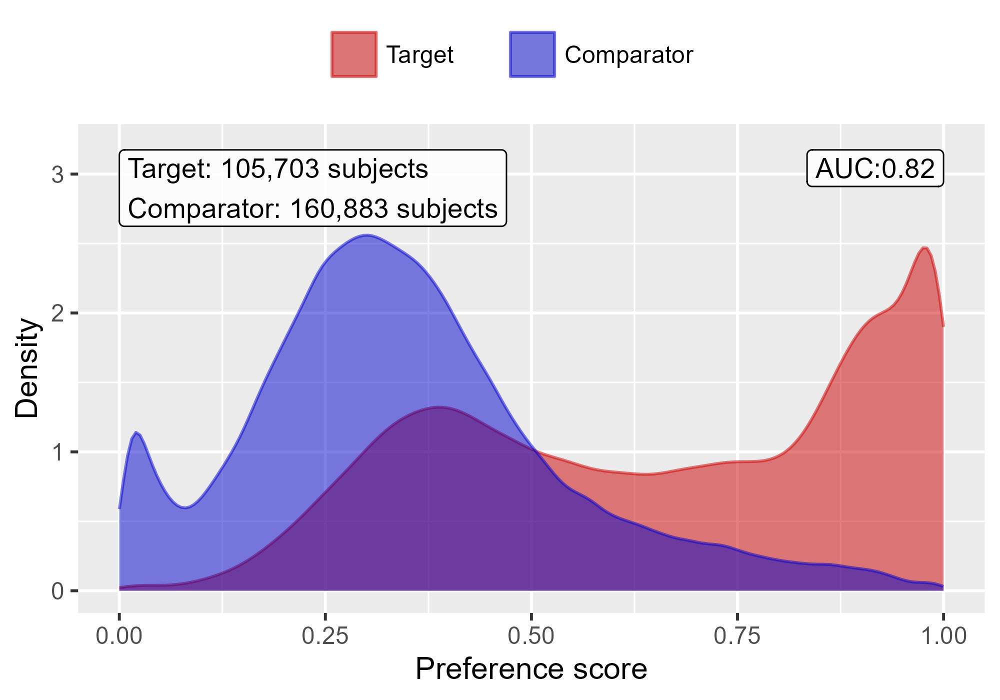

```{r}
#| label: setup
#| include: false
#| eval: true
library(ggplot2)

theme_set(theme_minimal(base_size = 18))
jhu_blue <- "#002D72"
jhu_gray <- "#7E7E7C"

# Code shown on the slides comes from the two study scripts
knitr::read_chunk("simulate-eunomia.R")
knitr::read_chunk("estimation-study.R")
knitr::read_chunk("evidence-synthesis.R")

# The simulation and Strategus run take a few minutes, so the scripts run only when their
# results are missing
if (!file.exists("estimation-study/simulation.rds")) source("simulate-eunomia.R")
if (!dir.exists("estimation-study/results/CohortMethodModule")) source("estimation-study.R")
if (!file.exists("estimation-study/evidence-synthesis.rds")) source("evidence-synthesis.R")

read_results <- function(module, table) {
  read.csv(file.path("estimation-study/results", module, paste0(table, ".csv")))
}

# Format a number for slide text, with a typographic minus sign
fmt <- function(x, digits = 2) sub("^-", "−", formatC(x, digits = digits, format = "f"))
fmt_ci <- function(hr, lower, upper) sprintf("%s (%s to %s)", fmt(hr), fmt(lower), fmt(upper))
```

```{r}
#| label: load-results
#| include: false
#| eval: true
gi_bleed <- 3

cm_analyses <- read_results("CohortMethodModule", "cm_analysis")
cm_results <- read_results("CohortMethodModule", "cm_result")
cm_results <- cm_results[cm_results$outcome_id == gi_bleed, ]
cm_diagnostics <- read_results("CohortMethodModule", "cm_diagnostics_summary")
cm_diagnostics <- cm_diagnostics[cm_diagnostics$outcome_id == gi_bleed, ]

cm_table <- merge(cm_analyses[, c("analysis_id", "description")], cm_results, by = "analysis_id")
cm_table <- merge(cm_table, cm_diagnostics, by = "analysis_id")
cm_table <- cm_table[order(cm_table$analysis_id), ]
short_labels <- c(
  "1" = "Unadjusted",
  "2" = "1:1 matching",
  "3" = "Variable-ratio matching",
  "4" = "Stratification",
  "5" = "IPTW",
  "6" = "1:1 matching + covariates"
)
cm_table$label <- short_labels[as.character(cm_table$analysis_id)]

result_for <- function(id) cm_table[cm_table$analysis_id == id, ]

# CohortMethod's own plots need the intermediate files Strategus keeps in its work folder
cm_work <- "estimation-study/work/CohortMethodModule"
cm_reference <- readRDS(file.path(cm_work, "outcomeModelReference.rds"))
work_file <- function(id, column) {
  row <- cm_reference$analysisId == id & cm_reference$outcomeId == gi_bleed
  file.path(cm_work, cm_reference[[column]][row])
}

# Negative control estimates for every analysis
cm_all_results <- read_results("CohortMethodModule", "cm_result")
cm_negative_controls <- cm_all_results[cm_all_results$outcome_id != gi_bleed & !is.na(cm_all_results$se_log_rr), ]

sccs_results <- read_results("SelfControlledCaseSeriesModule", "sccs_result")
sccs_sets <- read_results("SelfControlledCaseSeriesModule", "sccs_exposures_outcome_set")
sccs_covariates <- read_results("SelfControlledCaseSeriesModule", "sccs_covariate")
sccs_covariate_results <- read_results("SelfControlledCaseSeriesModule", "sccs_covariate_result")
sccs_diagnostics <- read_results("SelfControlledCaseSeriesModule", "sccs_diagnostics_summary")
sccs_gi_set <- sccs_sets$exposures_outcome_set_id[sccs_sets$outcome_id == gi_bleed]
sccs_gi <- sccs_results[sccs_results$exposures_outcome_set_id == sccs_gi_set, ]
sccs_diag <- sccs_diagnostics[sccs_diagnostics$exposures_outcome_set_id == sccs_gi_set, ]
sccs_windows <- merge(
  sccs_covariate_results[sccs_covariate_results$exposures_outcome_set_id == sccs_gi_set, ],
  unique(sccs_covariates[sccs_covariates$exposures_outcome_set_id == sccs_gi_set, c("covariate_id", "covariate_name")]),
  by = "covariate_id"
)
sccs_window <- function(name) sccs_windows[sccs_windows$covariate_name == name, ]

simulation <- readRDS("estimation-study/simulation.rds")
true_rr <- simulation$true_rate_ratio

evidence <- readRDS("estimation-study/evidence-synthesis.rds")
```

# Welcome

## Course Materials

The slides and the code behind every example are available on GitHub at [github.com/erikwestlund/2026-bids-bootcamp](https://github.com/erikwestlund/2026-bids-bootcamp).

## Today's Plan

1. A brief review of propensity scores
2. What CohortMethod does, and the settings that control how it uses the propensity score
3. Study diagnostics, and how to choose which analysis to report
4. A full CohortMethod study, run with Strategus on simulated data with a known answer
5. Outcome models, including doubly robust estimation
6. Self-controlled designs: the same question answered by a self-controlled case series
7. Combining results across the sites of a network study

# Propensity Scores in Brief

## The Propensity Score

The **propensity score** is each patient's probability of receiving the target treatment, given their baseline covariates.

- Patients with similar propensity scores have similar distributions of the measured covariates.
- Comparing patients with similar scores removes confounding by those covariates, much as randomization would.
- The score does nothing about confounders that were never measured.

. . .

On Wednesday we used `MatchIt` to match on a score estimated from age and sex. CohortMethod does the same thing with thousands of covariates.

## What We Covered on Wednesday

- The **estimand** depends on how the score is used. Matching treated patients to comparators targets the effect in the treated (ATT). Weighting the whole sample can target the effect in everyone (ATE).
- A **caliper** drops patients without a match within a pre-specified tolerance. The estimate then applies only to the patients who could be matched.
- **Doubly robust** estimation uses both a propensity score model and an outcome model. The estimate is consistent if either model is correctly specified.
- The **lasso** penalizes the propensity score model so that it keeps only the covariates that predict treatment. CohortMethod uses it by default, which lets it fit thousands of covariates, even when there are more covariates than patients.

# CohortMethod

## The Active Comparator New User Cohort Design

CohortMethod compares two treatments among patients who are starting one of them.

- **Target (T):** new users of celecoxib
- **Comparator (C):** new users of diclofenac
- **Outcome (O):** GI bleed
- **Time at risk:** the window after treatment starts in which outcomes are counted

. . .

Comparing two active treatments helps with confounding. Both groups had a reason to be treated, so they tend to be more alike than treated and untreated patients.

## What CohortMethod Does

1. Extracts the target and comparator cohorts, their outcomes, and their baseline covariates from the CDM.
2. Applies the study population rules, such as removing patients who had the outcome before starting treatment.
3. Fits a propensity score model with a lasso, using every available covariate.
4. Uses the score to match, stratify, or weight the patients.
5. Computes covariate balance and the other study diagnostics.
6. Fits the outcome model for the outcome of interest and each negative control outcome. A Cox model gives a hazard ratio, a Poisson model an incidence rate ratio, and a logistic model an odds ratio.

## Thousands of Covariates

- FeatureExtraction builds a covariate for each condition, drug, procedure, measurement, and demographic group in the year before treatment. A real study can have tens of thousands of them.
- CohortMethod fits the propensity score with Cyclops, a regularized regression package. Cross-validation picks the strength of the lasso penalty.
- The target and comparator drugs must be excluded from the covariates. A model that can see which drug a patient started predicts treatment perfectly.

## Four Ways to Use the Score

| Method | CohortMethod setting | Population the estimate describes |
|---|---|---|
| Matching | `createMatchOnPsArgs()` | The matched patients |
| Stratification | `createStratifyByPsArgs()` | All patients, pooled across strata |
| Weighting (IPTW) | `createTruncateIptwArgs()` | Set by `estimator`: target, both groups, or the overlap |

. . .

Each method keeps a different set of patients and weights them differently. When the treatment effect varies across patients, the methods can give different answers that are all correct for their own population.

## Matching

Each target patient is paired with comparator patients who have a similar propensity score.

- **1:1 matching** gives each target patient one comparator.
- **Variable-ratio matching** adds more comparators, up to a limit, when there are good ones. It keeps more data.
- The **caliper** sets how close a match must be. Patients with no match inside the caliper are dropped. CohortMethod's default is 0.2 standard deviations of the logit of the propensity score.

. . .

The estimate describes the matched patients. If most target patients are matched, that is the effect in the target group (ATT). In Eunomia's data with our settings, `r format(result_for(3)$target_subjects, big.mark = ",")` of `r format(result_for(1)$target_subjects, big.mark = ",")` celecoxib users find a match.

## Stratification

Stratification divides patients into groups with similar propensity scores, ten by default, and compares the two drugs within each group.

- It keeps nearly every patient.
- The outcome model compares patients only within their own group.

## Weighting

**Inverse probability of treatment weighting (IPTW)** keeps every patient and gives each a weight based on their propensity score.

- The weights can target the effect in the target group, in everyone, or in the patients who overlap.
- Patients with scores near 0 or 1 get very large weights, which makes the estimate unstable. CohortMethod caps the weights to limit this.

# Study Diagnostics

## Why Diagnostics Come First

A study can produce a confident hazard ratio from a design that yields poor evidence quality.

- OHDSI studies define a set of **diagnostics** and their thresholds before anyone sees the results.
- An analysis that fails a diagnostic is not reported as evidence. In the OHDSI results viewer, its estimate stays hidden, or **blinded**.
- Only analyses with no failed diagnostic are **unblinded**. A diagnostic that cannot be computed does not block unblinding.

## Covariate Balance: The SDM

The **standardized mean difference (SDM)** measures how different the two groups are on one covariate, in standard deviation units:

$$\text{SDM} = \frac{\bar{x}_T - \bar{x}_C}{\sqrt{(s_T^2 + s_C^2)/2}}$$

- The SDM can be positive or negative, depending on which group has the higher mean. The diagnostics use its **absolute value**, so a difference in either direction counts. An absolute SDM of 0 means the groups have the same mean.
- The usual rule treats an absolute SDM below **0.1** as balanced.
- CohortMethod computes the SDM for every covariate, before and after adjustment, and checks the largest absolute SDM.

## Balance in Practice

- The balance diagnostic fails if *any* covariate has an absolute SDM of 0.1 or more after adjustment. With thousands of covariates, this is a strict test.
- In a small database, a rare covariate can exceed 0.1 by chance. Setting `sdmAlpha` in `createCmDiagnosticThresholds()` makes the diagnostic fail only when an absolute SDM exceeds 0.1 by more than chance would explain. The test corrects for the number of covariates.
- Our study sets `sdmAlpha = 0.05` in its protocol, before seeing any results.

## Balance in a CohortMethod Study

{fig-align="center" height="480"}

Each dot is one of 70,161 covariates: its absolute SDM before matching (x) and after (y). After matching, the largest absolute SDM is 0.04. Example output from the CohortMethod documentation.

## Equipoise

**Equipoise** asks whether the two groups overlap enough to compare. The idea is to assess whether these patients in actual clinical practice could realistically have been given a different treatment.

- The **preference score** is a version of the propensity score that adjusts for the relative size of the two groups.
- Equipoise is the share of patients with a preference score between 0.3 and 0.7.
- The usual threshold requires equipoise of at least **0.2**, meaning at least 20% of patients are in this middle range.

. . .

Low equipoise means prescribers choose between the drugs based on patient characteristics, and few patients could plausibly have received either one.

## Equipoise in a CohortMethod Study

{fig-align="center" height="440"}

The middle of the plot, between 0.3 and 0.7, is where the two groups overlap. Example output from the CohortMethod documentation.

## MDRR

The **minimum detectable relative risk (MDRR)** is the smallest hazard ratio the study could detect with 80% power at α = 0.05.

- It depends on the number of outcomes and on how the patients split between the two groups. It does not depend on the estimate.
- An MDRR of 1.5 means the study can detect a 50% increase in risk. An MDRR of 20 means only a very large effect could be detected.
- CohortMethod's default threshold is an MDRR below **10**.

## Negative Controls and EASE

A **negative control** is an outcome that neither treatment causes, so its true hazard ratio is 1.

- The study runs every negative control through the same analysis as the outcome of interest.
- If many negative controls show an effect, the design has systematic error from unmeasured confounding, selection bias, or measurement error.
- The **expected absolute systematic error (EASE)** summarizes that error. An EASE of 0 means the negative controls show no systematic error.
- The usual threshold requires EASE below **0.25**.

. . .

The negative control estimates also **calibrate** the final confidence interval and p-value, so that they account for the systematic error the negative controls revealed.

## Common Cutoffs

| Diagnostic | Question | Passes when |
|---|---|---|
| Balance (SDM) | Are the groups comparable? | Max absolute SDM < 0.1, or not significantly above 0.1 with `sdmAlpha` |
| Equipoise | Do the groups overlap? | ≥ 20% with preference score 0.3–0.7 |
| MDRR | Is the study large enough? | MDRR < 10 |
| EASE | Is there systematic error? | EASE < 0.25 |

These are CohortMethod's defaults in `createCmDiagnosticThresholds()`; `sdmAlpha` is off by default. A protocol can set stricter values. A fifth diagnostic, generalizability, compares the analyzed patients with the population the estimate is meant to describe. It is off by default.

## Choosing Which Analysis to Report

A study usually runs several analyses: different matching ratios, calipers, stratification, and weighting.

1. Discard every analysis that fails a diagnostic.
2. Among the analyses that pass, choose the primary analysis using criteria set in advance, such as the best balance or the most patients retained.
3. Report every analysis in the paper or its supplement: the diagnostics for all of them, and the estimates for every analysis that passed, not only the primary one. Analyses that failed stay blinded.

. . .

The protocol should state these criteria before the results are unblinded to avoid p-hacking and similar follies.

## Protocols and Diagnostics Examples

- The LEGEND-T2DM protocol states that it will prefer stratification over matching if both balance the groups, because stratification keeps more patients. Matching is the fallback.
- **Protocols can be stricter than the defaults.** LEGEND-T2DM requires equipoise for a *majority* of patients, not 20%, and every absolute SDM below 0.1.
- **Diagnostics are reviewed while the estimates are blinded.** Only analyses that pass are interpreted, and only passing databases enter the meta-analysis.
- **Everything is published.** Results for every comparison are posted in a public results viewer, with their diagnostics.

. . .

The diagnostics remove real bias. Across 11,716 negative control analyses from LEGEND-HTN, only 14% passed every diagnostic. Among those, EASE fell from 0.38 to 0 (Conover et al., *JAMIA* 2025).

# Example Study With Eunomia

## Why Simulate

Eunomia's GI bleeds all happen within 90 days of starting an NSAID. That is enough for a cohort study, but a self-controlled design needs outcomes at other times too.

- We make a copy of Eunomia and keep its patients, their histories, and their NSAID dates.
- A script reassigns which drug each patient received and replaces the GI bleeds and the negative control outcomes with simulated ones.
- Because we wrote the simulation, we know the true effect. We can check whether each design recovers it.

The script is `simulate-eunomia.R`.

## The Question

In the 90 days after starting the drug, how does the rate of GI bleeds on celecoxib compare with the rate on diclofenac?

```{r sim-truth}
```

- In our adjusted Eunomia data, Celecoxib patients bleed at **0.7** times the rate of comparable diclofenac patients. That is the true rate ratio the study should recover.
- The effect is the same for every patient. Matching, stratification, and weighting therefore all target the same number, and so does a self-controlled design.

## Who Gets Celecoxib

Celecoxib was developed to be gentler on the stomach, so prescribers favor it for patients with a history of ulcers.

```{r sim-treatment}
```

Older patients and patients with a prior peptic ulcer are more likely to receive celecoxib. Those same patients have a higher bleed rate, which builds in confounding by indication.

## Simulating GI Bleeds

```{r sim-gi-bleeds}
```

- Bleeds happen throughout follow-up. The background rate is 0.1 per year, three times higher after an ulcer, and 30% higher per decade of age.

## Simulating Negative Controls

```{r sim-negative-controls}
```

The negative controls follow the same kind of background model, so they share the confounders. Neither drug affects them, so their true hazard ratio is 1.

# Running CohortMethod With Strategus

## What Strategus Does

**Strategus** runs a complete OHDSI study from a single analysis specification.

- The specification lists the cohorts and the analysis modules to run, such as CohortGenerator, CohortMethod, and SelfControlledCaseSeries.
- Each site in a network runs the same specification on its own data and shares only aggregate results.
- Today we run it on our simulated copy of Eunomia, a small synthetic CDM that runs on a laptop.

. . .

The full study is in `estimation-study.R`. The next slides show it in pieces.

## Cohorts and Negative Controls

```{r cohorts}
```

## Target, Comparator, and Outcomes

```{r cm-tco}
```

## Data and Population Settings

```{r cm-shared-args}
```

## The Time at Risk

The **time at risk** is the window in which outcomes are counted.

- An **on-treatment** window runs from starting the drug to stopping it. It fits drugs whose effect ends when the patient stops taking them.
- In Eunomia, every prescription starts and ends on the same day, so an on-treatment window would be one day long and contain almost no bleeds.
- Instead, we follow every patient for a fixed **90 days** from the day they start the drug. That matches the 90 days in which the simulation raises the bleed rate.

## Propensity Score and Balance Settings

```{r cm-ps-args}
```

## Analyses 1 and 2: Unadjusted and 1:1 Matching

```{r cm-match}
```

## Analysis 3: Variable-Ratio Matching

```{r cm-nto1}
```

## Analysis 4: Stratification

```{r cm-stratify}
```

## Analysis 5: Weighting

```{r cm-iptw}
```

## Analysis 6: Doubly Robust

This analysis is covered in the outcome models section.

```{r cm-dr}
```

## Diagnostic Thresholds

```{r cm-module}
```

## The Analysis Specification

Strategus collects the shared cohort definitions and each module's settings into one specification. The SelfControlledCaseSeries module is covered later.

```{r analysis-spec}
```

## Connecting to Eunomia

```{r connect}
```

## Running the Study

```{r execute}
```

. . .

Strategus writes each module's results as CSV files in `estimation-study/results/`. The slides that follow read those files.

## Who Is in Each Analysis

```{r}
#| label: show-counts
#| echo: false
#| eval: true
knitr::kable(
  data.frame(
    Analysis = cm_table$label,
    `Celecoxib patients` = cm_table$target_subjects,
    `Diclofenac patients` = cm_table$comparator_subjects,
    `Celecoxib GI bleeds` = cm_table$target_outcomes,
    `Diclofenac GI bleeds` = cm_table$comparator_outcomes,
    check.names = FALSE
  ),
  format.args = list(big.mark = ",")
)
```

Patients with a bleed before their NSAID are removed first. 1:1 matching keeps `r format(result_for(2)$target_subjects, big.mark = ",")` patients per group.

## Propensity Score Overlap

```{r}
#| label: ps-plot
#| echo: false
#| eval: true
#| fig-height: 4.2
CohortMethod::plotPs(
  readRDS(work_file(2, "psFile")),
  targetLabel = "Celecoxib",
  comparatorLabel = "Diclofenac",
  showCountsLabel = TRUE,
  showEquipoiseLabel = TRUE
)
```

Equipoise is `r fmt(result_for(2)$equipoise)`: `r round(100 * result_for(2)$equipoise)`% of patients have a preference score between 0.3 and 0.7, well above the 0.2 threshold.

## Covariate Balance

```{r}
#| label: balance-plot
#| echo: false
#| eval: true
#| fig-height: 4.4
balance <- read_results("CohortMethodModule", "cm_shared_covariate_balance")
balance <- balance[balance$analysis_id == 2, ]
max_after <- max(abs(balance$std_diff_after), na.rm = TRUE)

CohortMethod::plotCovariateBalanceScatterPlot(
  readRDS(work_file(2, "sharedBalanceFile")),
  threshold = 0.1,
  showCovariateCountLabel = TRUE,
  showMaxLabel = TRUE
)
```

Each point is a covariate. After 1:1 matching, the largest absolute SDM is `r fmt(max_after, 3)`.

## Balance in This Study

```{r}
#| label: imbalanced
#| echo: false
#| eval: true
covariates <- read_results("CohortMethodModule", "cm_covariate")
imbalanced <- balance[abs(balance$std_diff_after) >= 0.1, ]
imbalanced$name <- covariates$covariate_name[match(imbalanced$covariate_id, covariates$covariate_id)]
```

- After 1:1 matching, `r nrow(imbalanced)` covariates sit at or above 0.1: `r knitr::combine_words(imbalanced$name)`.
- Each is rare, with a mean of `r fmt(max(abs(c(imbalanced$target_mean_after, imbalanced$comparator_mean_after))), 2)` or less in both groups. With under 1,000 patients per group, differences this size are within chance, so the `sdmAlpha` test passes.
- Stratification fails. Its largest absolute SDM is `r fmt(result_for(4)$shared_max_sdm)`, far more than chance would explain.

## The Diagnostics

```{r}
#| label: show-diagnostics
#| echo: false
#| eval: true
pass_fail <- function(value, status, digits = 2) {
  ifelse(is.na(value), "\u2014", paste0(fmt(value, digits), " (", tolower(status), ")"))
}
knitr::kable(data.frame(
  Analysis = cm_table$label,
  `Max absolute SDM` = pass_fail(cm_table$shared_max_sdm, cm_table$shared_balance_diagnostic),
  Equipoise = pass_fail(cm_table$equipoise, cm_table$equipoise_diagnostic),
  MDRR = pass_fail(cm_table$mdrr, cm_table$mdrr_diagnostic),
  EASE = pass_fail(cm_table$ease, cm_table$ease_diagnostic),
  check.names = FALSE
))
```

Max absolute SDM is the largest across all covariates, for the shared population. A dash means the diagnostic was not evaluated.

## What the Diagnostics Mean

- `r knitr::combine_words(cm_table$label[cm_table$unblind == 1])` pass every diagnostic, so their estimates would be unblinded.
- Stratification fails balance, so it stays blinded. CohortMethod does not compute EASE for an analysis that fails balance.
- The unadjusted analysis has EASE `r fmt(result_for(1)$ease)`, which fails. Its negative controls show the confounding by ulcer history and age.

## The Negative Controls

```{r}
#| label: nc-plot
#| echo: false
#| eval: true
#| layout-ncol: 2
#| fig-width: 6
#| fig-height: 4.6
for (id in c(1, 2)) {
  ncs <- cm_negative_controls[cm_negative_controls$analysis_id == id, ]
  # CohortMethod computes EASE from an MCMC null, so use the same one here
  set.seed(1)
  null <- EmpiricalCalibration::fitMcmcNull(ncs$log_rr, ncs$se_log_rr)
  print(EmpiricalCalibration::plotCalibrationEffect(
    ncs$log_rr,
    ncs$se_log_rr,
    null = null,
    xLabel = "Hazard ratio",
    title = short_labels[[as.character(id)]],
    showExpectedAbsoluteSystematicError = TRUE
  ))
}
```

Each dot is a negative control, whose true hazard ratio is 1. Dots below the dashed line have p < 0.05. Unadjusted, most negative controls sit to the right of 1. After matching, they center on 1.

## The Hazard Ratios

```{r}
#| label: hr-plot
#| echo: false
#| eval: true
#| fig-height: 4.2
hr_data <- cm_table[!is.na(cm_table$rr), ]
hr_data$label <- factor(hr_data$label, levels = rev(cm_table$label))

ggplot(hr_data, aes(rr, label)) +
  geom_vline(xintercept = 1, color = jhu_gray) +
  geom_vline(xintercept = true_rr, color = "#A51417", linetype = "dashed") +
  geom_errorbarh(aes(xmin = ci_95_lb, xmax = ci_95_ub), height = 0.2, color = jhu_blue) +
  geom_point(size = 3, color = jhu_blue) +
  scale_x_log10() +
  labs(x = "Hazard ratio, celecoxib vs. diclofenac (dashed line: truth)", y = NULL)
```

## Interpreting the Results

Only the analyses that passed every diagnostic would be reported. We look at all of them, because here we know the true value, `r fmt(true_rr, 1)`.

- The unadjusted estimate is `r fmt_ci(result_for(1)$rr, result_for(1)$ci_95_lb, result_for(1)$ci_95_ub)`. Celecoxib went to older patients and patients with ulcers, who bleed more, so the unadjusted comparison makes celecoxib look worse than it is.
- Stratification gives `r fmt_ci(result_for(4)$rr, result_for(4)$ci_95_lb, result_for(4)$ci_95_ub)`, IPTW gives `r fmt_ci(result_for(5)$rr, result_for(5)$ci_95_lb, result_for(5)$ci_95_ub)`, and variable-ratio matching gives `r fmt_ci(result_for(3)$rr, result_for(3)$ci_95_lb, result_for(3)$ci_95_ub)`.
- 1:1 matching gives `r fmt_ci(result_for(2)$rr, result_for(2)$ci_95_lb, result_for(2)$ci_95_ub)`. It uses the fewest patients, and its interval is the widest. Every interval includes the truth.

## A Lesson From Building This Study

The first version of this study used FeatureExtraction's default covariates, and the adjusted estimates stayed too high.

- The defaults look back one year before the NSAID. Most of the simulated ulcers were recorded years earlier, so the propensity score model could not see the main confounder.
- Adding conditions recorded at any time before the NSAID (`useConditionGroupEraAnyTimePrior = TRUE`) fixed it.

. . .

A propensity score can only balance what the covariates record. The lookback windows are a design choice that belongs in the protocol, informed by how the confounders show up in the data.

# Self-Controlled Designs

## Comparing a Patient With Themself

A **self-controlled** design compares the same person at different times.

- Each patient serves as their own control.
- Anything about the patient that stays constant during the study cancels out, whether or not it was measured. Examples include genetics, sex, and chronic conditions.
- Confounders that change over time, such as age, season, or a new illness, still need adjustment.

## The Self-Controlled Case Series

The **self-controlled case series (SCCS)** uses only patients who had the outcome.

- Each patient's follow-up is divided into **exposed** time, such as the 90 days after starting a drug, and **unexposed** time.
- The model compares the outcome rate in exposed time with the rate in unexposed time, within each patient.
- The result is an **incidence rate ratio**.
- Age and season enter the model as smooth functions of time.

## When SCCS Fits

SCCS suits an acute outcome after a short exposure. The SelfControlledCaseSeries package checks its assumptions:

- Having the outcome must not change whether or when a patient later gets the drug. For example, doctors may avoid NSAIDs after a GI bleed. A **pre-exposure** window checks this. Its rate ratio should be near 1.
- The outcome does not end follow-up. A patient who dies of a bleed has no further unexposed time.
- Repeated outcomes in one patient are independent. If they are not, the analysis uses only the first outcome, and the outcome must be rare.
- The outcome rate is stable over calendar time, after adjusting for age and season.

## The Same Question in an SCCS

We put both drugs in one SCCS model. The model estimates the rate ratio for celecoxib vs. diclofenac in the 90 days after starting the drug. This is the same quantity as the cohort study's hazard ratio.

## SCCS in Strategus

```{r sccs-analysis}
```

## SCCS Results

The SCCS estimates a rate ratio of `r fmt_ci(sccs_gi$rr, sccs_gi$ci_95_lb, sccs_gi$ci_95_ub)` for celecoxib vs. diclofenac. The true value is `r fmt(true_rr, 1)`.

- The analysis uses `r format(sccs_gi$outcome_subjects, big.mark = ",")` patients with a GI bleed.
- Each patient's own unexposed time is the comparison, so the ulcer history that drove the drug choice cancels out.

## The Same Question, Two Designs

```{r}
#| label: two-designs
#| echo: false
#| eval: true
knitr::kable(data.frame(
  Design = c("Cohort: unadjusted", "Cohort: 1:1 matching", "Cohort: IPTW", "Self-controlled case series"),
  `Celecoxib vs. diclofenac (95% CI)` = c(
    fmt_ci(result_for(1)$rr, result_for(1)$ci_95_lb, result_for(1)$ci_95_ub),
    fmt_ci(result_for(2)$rr, result_for(2)$ci_95_lb, result_for(2)$ci_95_ub),
    fmt_ci(result_for(5)$rr, result_for(5)$ci_95_lb, result_for(5)$ci_95_ub),
    fmt_ci(sccs_gi$rr, sccs_gi$ci_95_lb, sccs_gi$ci_95_ub)
  ),
  check.names = FALSE
))
```

The true value is `r fmt(true_rr, 1)`. The cohort study removes confounding with a propensity score. The SCCS removes it by comparing each patient with themself. The adjusted cohort estimates and the SCCS estimate are close to the true value.

## SCCS Diagnostics

- Time stability, event–exposure dependence, event–observation dependence, and MDRR all pass.
- The rare outcome diagnostic `r tolower(sccs_diag$rare_outcome_diagnostic)`s because `r round(100 * as.numeric(sccs_diag$rare_outcome_prevalence))`% of patients have a GI bleed, above the 10% limit. The simulation gives everyone a high bleed rate so that the cohort study has enough outcomes.
- An analysis that fails a diagnostic stays blinded, so this estimate would not be reported.

## Other Designs in HADES

| Design | Comparison | Package |
|---|---|---|
| Active comparator new user cohort | New users of T vs. new users of C | CohortMethod |
| Self-controlled case series | Exposed vs. unexposed time in cases | SelfControlledCaseSeries |
| Self-controlled cohort | Time after vs. before exposure, in all exposed patients | SelfControlledCohort |

. . .

Each design has its own weaknesses. A cohort study is vulnerable to unmeasured confounders that differ between patients. An SCCS is vulnerable to factors that change over time within a patient. When two designs agree, the result is more credible.

# Combining Results Across Sites

## Network Studies

In an OHDSI network study, each site runs the same Strategus specification on its own data.

- Patient-level data never leave the site.
- Each site shares aggregate results: counts, diagnostics, estimates, and a summary of its likelihood.
- A coordinating center combines the site results into a single estimate. This step is **evidence synthesis**, a form of meta-analysis.
- Only sites whose analyses pass the diagnostics enter the synthesis. The MDRR is the exception: a site too small to detect an effect on its own can still contribute to the combined estimate.

## Fixed and Random Effects

- A **fixed-effect** meta-analysis assumes every site estimates the same true effect. Differences between sites are sampling error.
- A **random-effects** meta-analysis allows the true effect to vary across sites, for example because of different populations or coding practices. It estimates the average effect and the between-site variation, called **tau** (τ).
- When the sites differ, a random-effects analysis gives a wider and more honest confidence interval.

## The Problem With Small Sites

A traditional meta-analysis combines each site's log hazard ratio and its standard error.

- This assumes each site's likelihood is approximately normal, which fails when a site has few outcomes.
- If one group at a site has no outcomes, its hazard ratio and standard error are undefined. The site has to be dropped.
- Dropping sites this way can bias the combined estimate, because the decision to drop a site depends on its outcomes.

## OHDSI's Approach

Each site shares an approximation of its full **likelihood curve** for the treatment effect. CohortMethod writes this to `cm_likelihood_profile.csv`.

- The coordinating center combines the curves directly. The EvidenceSynthesis package does this for fixed effects and for Bayesian random effects.
- A site with no outcomes in one group still has a likelihood curve, so it still contributes information.

## A Simulated Network

```{r es-simulate}
```

## The Small Sites

```{r es-simulate-small}
```

## Fitting Each Site

```{r es-fit-sites}
```

## Two Ways to Combine

```{r es-traditional}
```

```{r es-likelihood}
```

## The Site Estimates

```{r}
#| label: es-forest
#| echo: false
#| eval: true
#| fig-height: 4.4
sites <- evidence$site_estimates
site_labels <- sprintf("Site %d (%d %s)", sites$site, sites$outcomes,
                       ifelse(sites$outcomes == 1, "outcome", "outcomes"))

EvidenceSynthesis::plotMetaAnalysisForest(
  data = evidence$site_grids,
  labels = site_labels,
  estimate = evidence$random_effects,
  xLabel = "Hazard ratio",
  limits = c(0.1, 20),
  showPredictionInterval = FALSE
)
```

## What the Simulation Shows

- `r sum(!is.finite(evidence$site_estimates$seLogRr))` of the `r nrow(evidence$site_estimates)` sites have no usable estimate, so the traditional meta-analysis drops them. The likelihood-based methods use all `r nrow(evidence$site_estimates)`.
- In this network, the five large sites hold nearly all the outcomes, so all three methods land close to the true hazard ratio of 2.
- The likelihood-based approach matters most when many sites are small or the outcome is rare. Then the dropped sites hold a meaningful share of the information, and the normal approximation fails at the sites that remain.

## In Strategus

- `EvidenceSynthesisModule` runs the synthesis on the combined results database after every site has uploaded its results.
- It offers three methods: a fixed-effect and a random-effects meta-analysis, both using the normal approximation, and a Bayesian random-effects meta-analysis that uses the site likelihood profiles.
- It includes only the sites that pass the diagnostics and writes combined estimates for each analysis.
- The OHDSI results viewer shows the site-level and combined estimates side by side.

## Summary

- CohortMethod adjusts for thousands of covariates with a lasso propensity score, then matches, stratifies, or weights.
- Diagnostics decide which analyses are reported. The diagnostic rules and the criteria for choosing the primary analysis belong in the protocol, and every analysis is reported.
- Adding the covariates to the outcome model can reduce imbalance left by a flawed propensity score. It changes the estimand to a conditional hazard ratio.
- Self-controlled designs remove confounding by anything that does not change within a patient. With the right setup, a self-controlled case series answers the same question as the cohort study.
- Network studies combine site results without sharing patient data. Combining site likelihoods lets small sites contribute.

## Questions?
